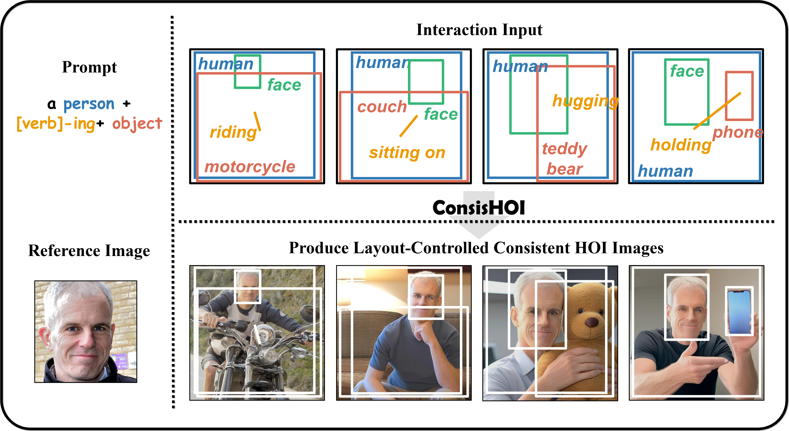

# Consishoi — Consistent Human-Object Interaction Generation (SDXL extension)

<p align="center">
	
</p>

<div align="center">

This is the official code repository for ConsisHOI, a framework that enables the generation of consistent Human-Object Interaction (HOI) images adhering to precise layout constraints, built upon Stable Diffusion XL.

</div>

---


**Requirements**

- Python 3.10+
- See root `requirements.txt` for full dependency list.

Quick setup:

```bash
conda create -n consishoi python=3.10 -y
conda activate consishoi
pip install -r requirements.txt
```

**🛠️Usage**

***Inference***

Generate one image with the unified pipeline:

```bash
python inference.py \
	--consishoi_model_path /path/to/consishoi_model_dir \
	--id_image /path/to/id_image.png \
	--prompt "a person is riding a motorcycle" \
	--out_image ./OUTPUTS/output.png \
	--steps 50 \
    --scale 5.0 \
    --device cuda
```

Example `interaction_cfg` :

```py
interaction_cfg = {
	'subject_phrases': ['person'],
	'object_phrases': ['motorcycle'],
	'action_phrases': ['a person is riding a motorcycle'],
	'subject_boxes': [[x0, y0, x1, y1]],
	'object_boxes': [[x0, y0, x1, y1]],
	'scheduled_sampling_beta': 1.0,
}
```

***Training***

Train with a single model path for base weights:

```bash
python train.py \
	--consishoi_model_path /path/to/consishoi_model_dir \
	--output_dir ./OUTPUTS/ \
	--train_batch_size 4 \
	--device cuda
```

- If GPU memory is tight, consider enabling CPU offload in the pipeline or using lower `dtype` where supported.

**License & Contact**

This project is licensed under the MIT License - see the LICENSE file for details.

---
